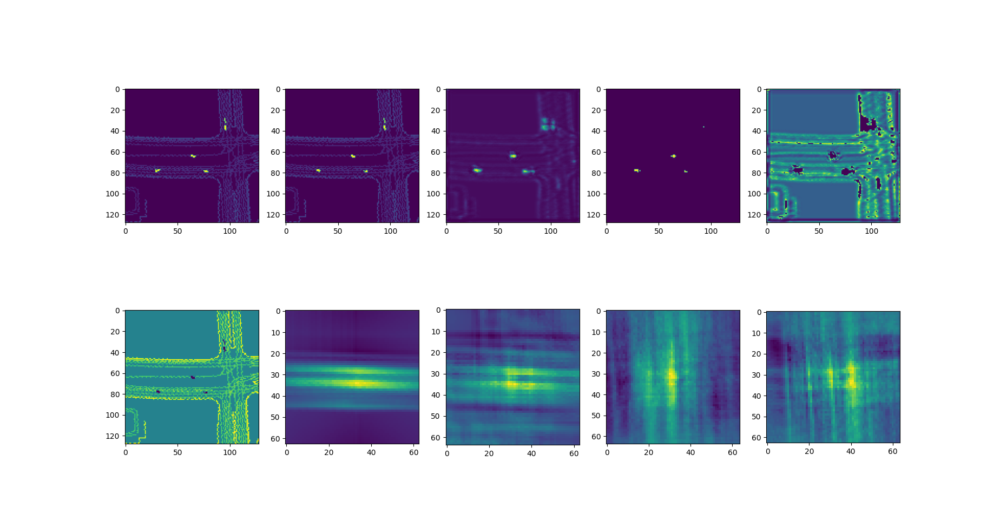

# 100ms-Motion-LSTM
A motion prediction lstm trained on the waymo dataset. Therefore it is limited to educational and non commercial use.

## Waymo Dataset
1000 training scenarios of 20 seconds each. Those scenarios have a datasize of 400 - 600 Megabytes.

## Data Encoding to Image format
The information contained in the waymo dataset is stored in tf-record files. Those are binary dump files. By using the correct position arguments for indexing the information can be read. 

To acheive a correlation between the map and the object positions the scenario is plotted into a image. Those images represent a bird eyes view of the current scenario timestep. Also a reduction in data size is aceived. Storing those converted scenario images takes only 700 Megabytes in total. 
This is acheived by a reduction of resolution to a 1x1 meter grid. The information is rasterized to this grid. If elements are smaller then 1x1 meter their size will be increased to 1x1 meter.  

## Model
The model is currently only trained on the first second of each of these scenarios.
<table>
  <tr>
    <td></td>
  </tr>
  <tr>
    <td><em>Figure 1:</em> Model structure plot.</td>
  </tr>
</table>

## Preparation of Model Output
Since the quality of the outputted images is quite low some amount of postprocessing is used to generate a clear input image for the next inference step.
<table>
  <tr>
    <td></td>
    <td></td>
  </tr>
  <tr>
    <td><em>Figure 2:</em> Example inference output with input images, inference output, filtered output and map movement detection outputs.</td>
    <td><em>Figure 3:</em> Sketch of map movement detection concept.</td>
  </tr>
</table>

## Inference
For inference the past second is fed into the model. The next image with a time offset of 100 ms is the model output. The inference will be repeated until the desired amout of prediction time is covered. For more accurate prediction results the model output is enhanced and the original map information is added back to each predicted frame. 

