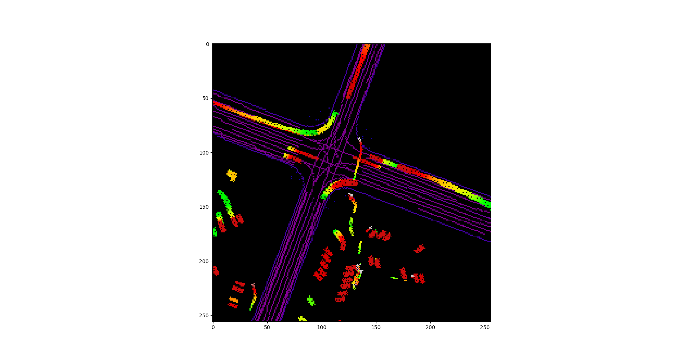

# Rainbow-Motion-CNN
A motion prediction cnn trained on the waymo dataset. Therfore it is awesomly accurate but limited to educational and non commercial use.

## Main concept
This repository contians the code for my submission to the Waymo Motion Prediction Challenge 2021. It is based on Wayom's data and inspired by the Minigo [[1]](#1) project. 

### Challenge Overview
"Given agents' tracks for the past 1 second on a corresponding map, predict the positions of up to 8 agents for 8 seconds into the future. To enable the motion prediction challenge, the ground truth future data for the test set is hidden from challenge participants. As such, the test sets contain only 1 second of history data. The validation sets contain the ground truth future data for use in model development. In addition, the test and validation sets provide a list of up to 8 object tracks in the scene to be predicted. These are selected to include interesting behavior and a balance of object types." [[2]](#2)

### Data conversion
Information from the dataset is converted into a grid from ego vehicle perspective. The following images are a visualization of this concept. Each time step is added as a new state to the data grid. This way vehicle traces show up in color gradients. :rainbow:

<em>Figure 1:</em> Image of the Rainbow Traces for past second stored in the scenario.

<em>Figure 2:</em> Rainbow Traces for all time steps stored in the sceanrio.

## References
<a id="1">[1]</a> 
Minigo: A minimalist Go engine modeled after AlphaGo Zero, built on MuGo. 
Online.
[github.com](https://github.com/tensorflow/minigo).

<a id="2">[2]</a> 
Waymo Open Dataset - Motion Prediction Challenge. 
Online. 
[waymo.com](https://waymo.com/open/challenges/2021/motion-prediction/).
